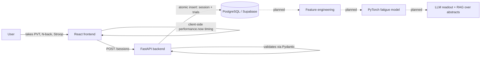

# Cognitive Assessment Platform

A self-contained web platform that measures cognitive fatigue through short, validated behavioral tasks rather than self-report alone. Users complete brief cognitive assessments several times a day; the resulting trial-level behavioral data (reaction time, accuracy, error type) plus self-reported sleepiness is intended to feed a PyTorch model that predicts a personalized fatigue score, explained to the user through an LLM-generated, research-grounded readout.

> **This is a portfolio research project, not a medical or diagnostic tool.**

## Status

**Phase 1 (data collection) — in progress.** The full three-task assessment (PVT, N-back, Stroop) is built, end-to-end verified, and deployed against a live production database. I'm currently the only participant, self-testing 3-4x/day to build the longitudinal dataset the modeling phase depends on. The PyTorch model and LLM readout layer (Phase 3+) haven't been built yet — see [Project_Management.md](Project_Management.md) for the full roadmap and decision log.

## Why this project

This project exists to demonstrate:
- **End-to-end ML engineering** — data collection design, schema/constraint design, feature engineering, and (eventually) model training and deployment, not just a notebook.
- **Applied deep learning** — a transformer encoder over sequences of trial-level behavioral features, with self-supervised pretraining as a stretch goal.
- **LLM tooling beyond prompt-and-summarize** — structured/function-calling output grounded in a small retrieval corpus (RAG over neuroscience abstracts via pgvector), not a single free-text prompt.
- **Real data, real constraints** — every schema and protocol decision below was made to keep the dataset usable for modeling later, not just to ship a demo.

## How it works



Reaction time is timed client-side with `performance.now()` rather than round-tripped to the server, so network jitter never contaminates the signal the model will eventually train on.

## Cognitive tasks

| Task | Measures | Duration |
|---|---|---|
| **Psychomotor Vigilance Task (PVT)** | Sustained attention, raw reaction time — a gold standard in sleep/fatigue research | ~90 sec |
| **N-back** (2-back) | Working memory load, which degrades under fatigue | ~90 sec |
| **Stroop** | Attentional control; distinguishes interference errors from random errors | ~90 sec |

Full session target: under 5 minutes, low enough friction to sustain multiple times a day.

## Notable design decisions

Full rationale for each of these lives as inline comments in the referenced file, plus the decision log in [Project_Management.md](Project_Management.md). Flagging the non-obvious ones here since they shape how the data should be interpreted:

- **PVT is a speed task, not a correct/incorrect task.** Any on-time response is `accuracy: true` regardless of how slow — a "lapse" shows up in `reaction_time_ms`, not as an error. Only false starts and non-responses count as errors. (`frontend/src/tasks/pvt/pvtConfig.ts`)
- **N-back uses two forced-choice keys (F = match, J = no match) on every trial**, not a respond-only-on-match design — otherwise a non-response is ambiguous between "correctly withheld" and "missed." Revised once already after self-testing surfaced a usability issue (see decision log): switched from flashed letters to a continuously visible word with a countdown bar. (`frontend/src/tasks/nback/nbackConfig.ts`)
- **Stroop's response keys (D/F/J/K) are arbitrary, not first-letter mnemonics**, and shown as an always-visible legend — first-letter keys would let word-reading leak into the response itself, undermining the interference measure. (`frontend/src/tasks/stroop/stroopConfig.ts`)
- **`context_tag` is self-tagged (morning / pre-work / post-work / pre-sleep), not derived from clock time** — this is meant to separate circadian fatigue from cognitive-exertion fatigue as distinct causal sources.
- **Database constraints mirror application constraints, not the other way around.** `error_type` is only valid when `accuracy = false` (enforced by a Postgres `CHECK` constraint *and* a Pydantic validator), and `context_tag`/`task_type`/`error_type` are real DB-level enums, not free-text columns trusted to the app layer.

## Tech stack

| Layer | Choice |
|---|---|
| Frontend | React 19 + TypeScript, Vite |
| Backend | FastAPI |
| Database | PostgreSQL (Supabase), `pgvector` enabled from the start for the future RAG layer |
| ORM / migrations | SQLAlchemy + Alembic — every schema change is a versioned migration, no hand-run SQL |
| Modeling (planned) | PyTorch (transformer encoder), XGBoost baseline |
| LLM layer (planned) | Provider-agnostic wrapper, structured/function-calling output, RAG over a curated PubMed abstract corpus |
| Deployment | Render (backend) + Vercel/Netlify (frontend), free tiers |

## Data model

```
sessions
├─ session_id          UUID, PK
├─ user_id             string
├─ timestamp           server-assigned, prevents client clock drift
├─ context_tag         enum: morning | pre_work | post_work | pre_sleep | other
├─ kss_pre, kss_post    int 1-9 (Karolinska Sleepiness Scale, self-report)
├─ sleep_hours          float
├─ hours_since_waking   float
└─ timezone             enum: EST | CST | MST | PST

trials
├─ trial_id            UUID, PK
├─ session_id          FK → sessions, cascade delete
├─ task_type           enum: pvt | nback | stroop
├─ trial_number        int
├─ reaction_time_ms     float, nullable (null = no response, not zero)
├─ accuracy             bool
├─ error_type           enum: interference | random | none, nullable
│                        (CHECK: only settable when accuracy = false)
└─ raw_response         jsonb, reserved for future keypress/mouse dynamics
```

## Getting started

Requires Python 3.11+, Node 18+, and a PostgreSQL database (a free [Supabase](https://supabase.com) project works well and is what this project uses).

### Backend

```bash
cd backend
python -m venv .venv && .venv\Scripts\activate   # or `source .venv/bin/activate` on macOS/Linux
pip install -r requirements.txt
cp .env.example .env   # fill in DATABASE_URL and CORS_ALLOWED_ORIGINS
alembic upgrade head
uvicorn app.main:app --reload
```

### Frontend

```bash
cd frontend
npm install
cp .env.example .env   # set VITE_API_URL to the backend above
npm run dev
```

Open the printed local URL, complete a session (setup → PVT → N-back → Stroop → post-session KSS), and confirm it lands in the `sessions`/`trials` tables.

## Repository structure

```
backend/
  app/
    models.py      SQLAlchemy models (DB-level enums, check constraints, cascade delete)
    schemas.py      Pydantic request/response schemas (mirrors DB constraints for fast-failing 422s)
    main.py         FastAPI app — POST /sessions
    database.py     DB session/engine setup
  alembic/versions/  Versioned migrations (source of truth for schema history)

frontend/
  src/
    tasks/pvt/       PVT state machine + config
    tasks/nback/      N-back state machine + config
    tasks/stroop/     Stroop state machine + config
    components/       Session setup form, KSS rating, submit flow
    api/              Fetch client + session submission
    types/session.ts  TS types mirrored from backend/app/schemas.py

Project_Management.md   Full design rationale, phase roadmap, decision log
```

## Verification approach

Each task was verified end-to-end with scripted Playwright runs against an isolated backend/frontend/dev-DB instance before being trusted with real data — covering the happy path, forced timeouts, false starts, and (for Stroop) both interference and random error branches — with test sessions cascade-deleted afterward. See the decision log in `Project_Management.md` for specifics per task.

## Ethics & privacy

- This is a self-testing research project; I am currently the only participant.
- Explicit, repeated disclaimer: not a medical or diagnostic tool — a fatigue *score* here is a research construct, not a clinical measure.
- Should this ever extend to other participants, informed consent and a data-use disclosure would be required before collecting a single session — no exceptions.

## A note on AI-assisted development

AI assistance was used for scaffolding and boilerplate (CRUD endpoints, migration files, config). Every schema constraint, task protocol parameter, and modeling/architecture decision is mine, documented inline where non-obvious, and I can walk through the reasoning behind each one.
